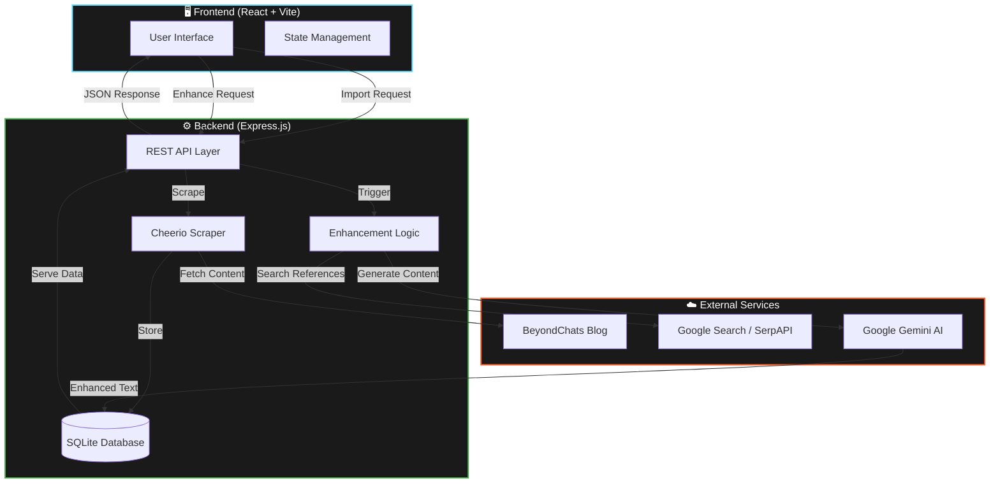

# BeyondChats Article Enhancement System

<div align="center">


**A professional full-stack solution for scraping, analyzing, and enhancing content using State-of-the-Art AI.**

[Live Demo 🚀](https://your-deployment-url.vercel.app) • [API Documentation 📖](https://your-backend-url.railway.app/docs) • [Report Bug 🐛](https://github.com/your-username/beyondchats-assignment/issues)

</div>

---

## 🎨 Overview

This project is a sophisticated **full-stack application** designed to automate the process of enhancing blog content. It seamlessly integrates web scraping, intelligent search, and Large Language Models (LLMs) to transform legacy articles into improved, thoroughly cited, and engaging pieces of content.

The system is built with a focus on **robustness, aesthetics, and user experience**, featuring a dark-mode-first design inspired by top-tier creative platforms.

---

## 🏗️ System Architecture

The following diagram illustrates the high-level data flow and component interaction within the system.



### 🧠 Data Flow Pipeline

1.  **Ingestion**: The `Scraper` module targets specific legacy pages (14 & 15) of the BeyondChats blog, extracting core content while filtering out noise.
2.  **Persistence**: Data is normalized and stored in a local `SQLite` database, ensuring data integrity and quick retrieval.
3.  **Enhancement**:
    *   **Contextual Search**: The system queries Google/DuckDuckGo for high-authority reference material related to the article topic.
    *   **Intelligence Injection**: **Google Gemini (gemini-2.0-flash-lite)** processes the original content alongside scraped references.
    *   **Synthesis**: A new, engaging version of the article is generated, complete with correct citations and Markdown formatting.
4.  **Presentation**: The React frontend renders the dual-view interface, allowing seamless comparison between the original and enhanced versions.

---

## ✨ Key Features

### Phase 1: Robust Backend Foundation ✅
*   **Precision Scraping**: Custom-built `Cheerio` scraper optimized for BeyondChats DOM structure.
*   **Resilient API**: RESTful endpoints with error handling, rate limiting protection, and CORS configuration.
*   **Database**: Zero-config `SQLite` setup with `Sequelize` ORM for easy schema management.

### Phase 2: AI-Powered Engine ✅
*   **Smart Search**: Fallback-enabled search mechanism (SerpAPI → DuckDuckGo) to ensure reference discovery.
*   **Anti-Bot Bypass**: Advanced filtering to exclude un-scrapeable domains (Medium, Reddit) and prioritize high-quality blogs.
*   **Context-Aware Prompts**: Engineered prompts that guide the LLM to preserve the original author's voice while improving structure.

### Phase 3: Premium Frontend Experience ✅
*   **Glassmorphism UI**: Modern aesthetic with backdrop blurs, subtle gradients, and crisp typography.
*   **Dark Mode**: A carefully crafted dark theme using Tailwind CSS variables for visual comfort.
*   **Responsive**: Fluid layout that adapts perfectly from desktop to mobile devices.
*   **Interactive**: Smooth transitions, loading skeletons, and intuitive navigation.

---

## 🛠️ Technology Stack

| Component | Tech | Description |
| :--- | :--- | :--- |
| **Frontend** |   | React 18, Vite, Lucide Icons, React Router |
| **Backend** |   | Express.js, Axios, Cheerio, Dotenv |
| **Database** |   | SQLite3, Sequelize ORM |
| **AI & ML** |  | Google Generative AI SDK |

---

## 🚀 Local Setup Instructions

Follow these steps to get the project running on your local machine.

### Prerequisites
*   Node.js (v18 or higher)
*   npm or yarn

### 1. clone the Repository
```bash
git clone https://github.com/your-username/beyondchats-assignment.git
cd beyondchats-assignment
```

### 2. Configure Backend
```bash
cd backend
npm install
```
Create a `.env` file in the `backend/` directory:
```env
# Server Config
PORT=3000

# AI Configuration (Get key from ai.google.dev)
GEMINI_API_KEY=your_gemini_api_key

# Search Configuration (Optional - Defaults to Free DuckDuckGo)
SERP_API_KEY=your_serp_api_key
```

### 3. Initialize & Start Backend
```bash
# Scrape the initial seed data (5 oldest articles)
npm run scrape

# Start the development server
npm run dev
```
*The backend will run on `http://localhost:3000`*

### 4. Configure & Start Frontend
Open a new terminal window:
```bash
cd frontend
npm install
npm run dev
```
*The frontend will run on `http://localhost:5173`*

---

## 🧪 Testing the Workflow

1.  **View Articles**: Open the frontend. You should see the 5 initial articles.
2.  **Import More**: Navigate to the "Import" page. Select a page number and click **Import** on any article card.
3.  **Enhance**: Go to an article's detail page. Click the **"Enhance with AI"** button in the top right.
    *   *Note: This process takes ~30 seconds as it searches, scrapes references, and generates content.*
4.  **Compare**: Toggle between "Original" and "Enhanced" tabs to see the transformation.

---

## 📦 Deployment

### Frontend (Vercel)
1.  Push code to GitHub.
2.  Import `frontend` directory into Vercel.
3.  Add Environment Variable: `VITE_API_URL` = `https://your-backend.railway.app/api`
4.  Deploy.

### Backend (Railway)
1.  Import `backend` directory into Railway.
2.  Add Environment Variables from your local `.env`.
3.  Deploy.

<div align="center">

**Built with ❤️ for BeyondChats**

</div>
